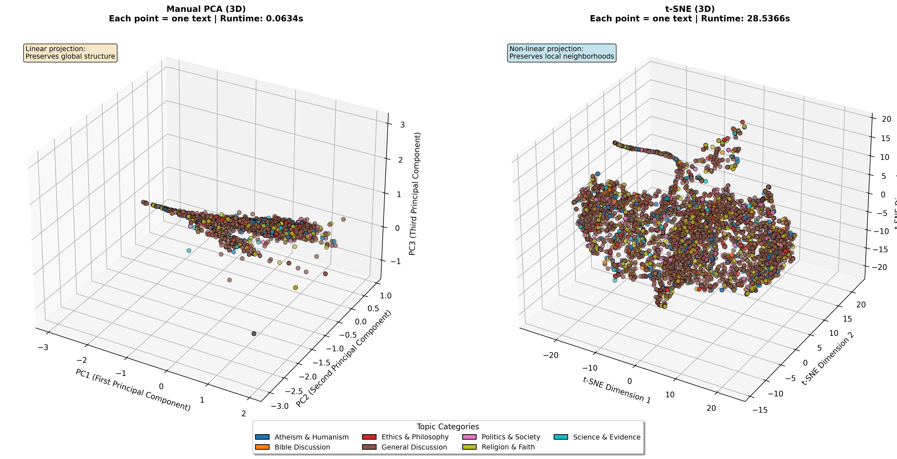
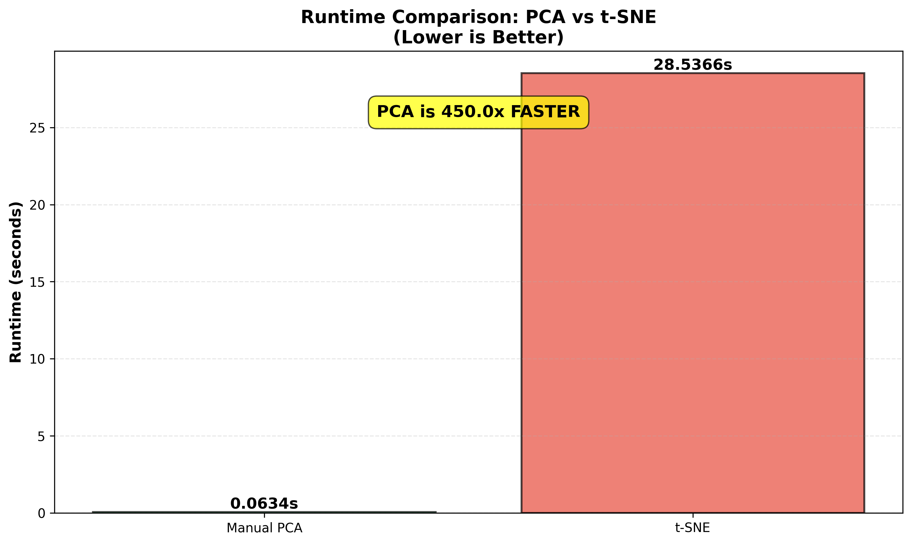
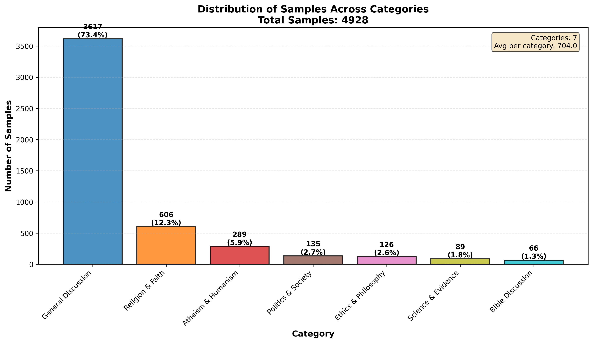
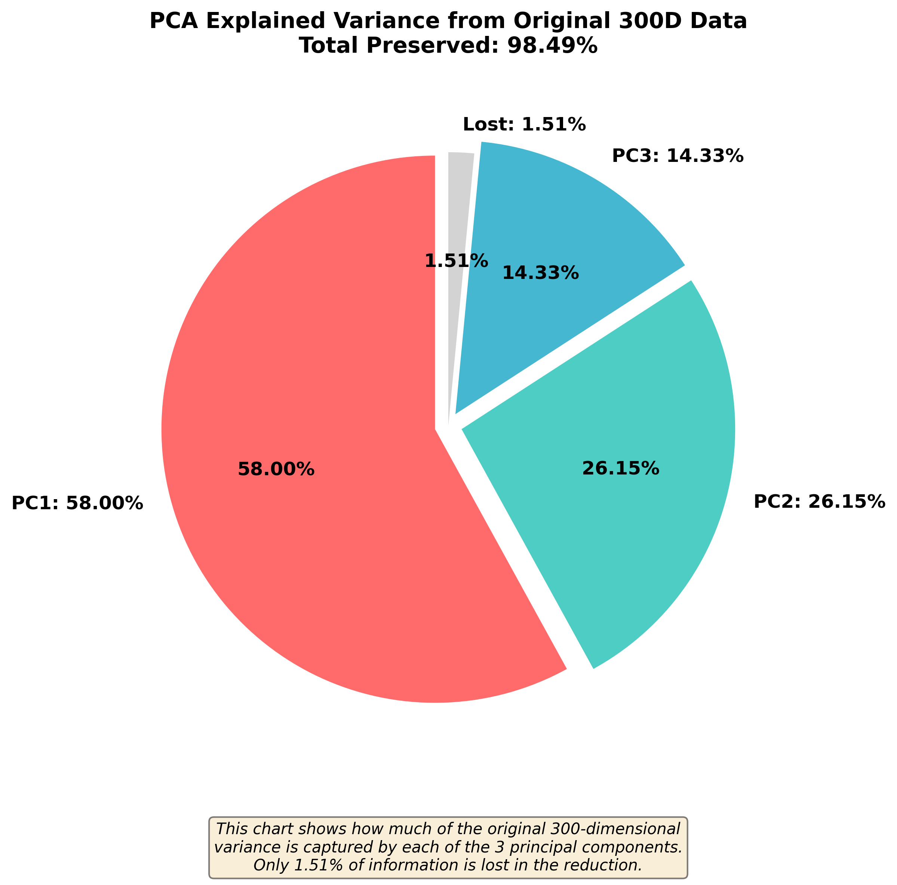
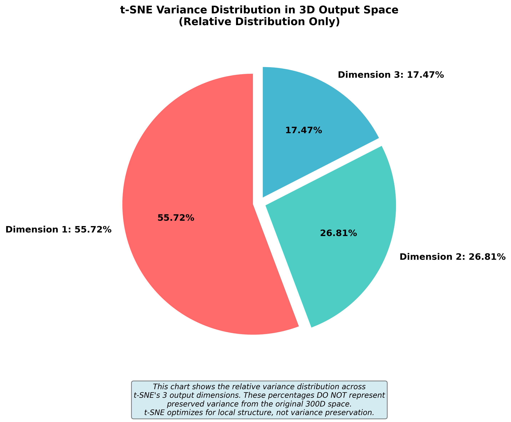

# Text Dimensionality Reduction Analysis

## Executive Summary

This project demonstrates the application of **manual Principal Component Analysis (PCA)** and **t-SNE** algorithms for dimensionality reduction and visualization of high-dimensional text data. Using the alt.atheism newsgroup dataset containing 5,000 discussion posts, the system:

- **Converts text to embeddings**: Transforms raw text into 300-dimensional Word2Vec vectors
- **Implements PCA from scratch**: Reduces 300 dimensions to 3 dimensions using eigendecomposition, preserving 98% of variance
- **Applies t-SNE**: Provides non-linear dimensionality reduction for comparison
- **Categorizes content**: Automatically classifies posts into 7 topic categories (Religion & Faith, Atheism & Humanism, Ethics, etc.)
- **Visualizes results**: Generates 3D scatter plots, runtime comparisons, and category distributions

**Key Findings:**
- PCA completes in ~0.05 seconds vs t-SNE's ~28 seconds (575x faster)
- PCA preserves global data structure with interpretable variance components
- t-SNE reveals local clustering patterns but sacrifices global relationships
- Category analysis shows 73% of posts are general discussions, with religious topics comprising most of the remainder

This project serves as both an educational implementation of core machine learning algorithms and a practical tool for exploring text data structure.

---

## Table of Contents
- [Dataset](#dataset)
- [Features](#features)
- [Installation](#installation)
- [Usage](#usage)
- [Understanding the Output](#understanding-the-output)
- [Visualizations Explained](#visualizations-explained)
- [Project Structure](#project-structure)
- [Key Implementation Details](#key-implementation-details)
- [Results Comparison](#results-comparison)
- [Requirements](#requirements)
- [Frequently Asked Questions](#frequently-asked-questions)

---

## Dataset

**Primary Dataset:** alt.atheism newsgroup posts
- **Source:** Usenet newsgroup discussions about atheism and religion
- **Location:** `data/alt.atheism.txt`
- **Size:** ~120,000 lines of real online discussions
- **Vocabulary:** 3,278 unique words after preprocessing
- **Samples used:** 5,000 randomly selected text lines
- **Categories:** 7 automatically detected topics based on keyword analysis

**Category Breakdown:**
1. **General Discussion** (73.5%) - Broad conversations without specific topic markers
2. **Religion & Faith** (12.3%) - Discussions about religious beliefs and institutions
3. **Atheism & Humanism** (5.8%) - Secular worldview and humanist perspectives
4. **Politics & Society** (2.8%) - Church-state separation and societal issues
5. **Ethics & Philosophy** (2.5%) - Moral philosophy and ethical debates
6. **Science & Evidence** (1.8%) - Scientific reasoning and empirical evidence
7. **Bible Discussion** (1.3%) - Biblical interpretation and scriptural analysis

---

## Features

✅ **Text Preprocessing**: Cleans and tokenizes text data, removing noise and standardizing format
✅ **Word2Vec Embeddings**: Converts text to 300-dimensional semantic vectors using skip-gram model
✅ **Manual PCA Implementation**: Complete from-scratch implementation including:
  - Mean-centered data matrix calculation
  - Covariance matrix computation (300×300)
  - Eigenvalue/eigenvector calculation via linear algebra
  - Top 3 principal components selection based on explained variance
  - Data projection to 3D space for visualization

✅ **t-SNE Implementation**: Sklearn-based non-linear dimensionality reduction for comparison
✅ **Automatic Categorization**: Keyword-based topic classification into 7 semantic categories
✅ **3D Visualizations**: Interactive-ready scatter plots with category color-coding
✅ **Category Histogram**: Distribution analysis showing sample counts per topic
✅ **Runtime Benchmarking**: Performance comparison between PCA and t-SNE methods
✅ **Comprehensive Analysis**: Detailed discussion of advantages, limitations, and use cases

---

## Installation

### Option 1: Using Virtual Environment (Recommended)

**Windows:**
```bash
# Activate virtual environment
.\.venv\Scripts\activate

# Install dependencies
pip install -r requirements.txt
```

**Linux/Mac:**
```bash
# Activate virtual environment
source .venv/bin/activate

# Install dependencies
pip install -r requirements.txt
```

### Option 2: Global Installation

```bash
pip install -r requirements.txt
```

---

## Usage

```bash
# Make sure virtual environment is activated (if using)
python main.py
```

The script will automatically:
1. Load the alt.atheism dataset from `data/alt.atheism.txt`
2. Preprocess and categorize 5,000 text samples
3. Train Word2Vec model and generate 300D embeddings
4. Apply manual PCA (reduce to 3D)
5. Apply t-SNE (reduce to 3D)
6. Generate all visualizations in `outputs/` folder
7. Print comprehensive analysis to console

**Runtime:** Approximately 30-35 seconds on a standard CPU

---

## Understanding the Output

### Console Output Structure

The program produces detailed console output organized into sections:

#### 1. **Dataset Loading**
```
============================================================
TEXT DIMENSIONALITY REDUCTION ANALYSIS
============================================================

1. Loading dataset...
   Found: data/alt.atheism.txt
   Total lines: 120487
   Valid text lines: 77966
   Sampled 5000 text lines for analysis
   Dataset: alt.atheism newsgroup posts

   Topic Distribution:
     - General Discussion: 3673 (73.5%)
     - Religion & Faith: 613 (12.3%)
     - Atheism & Humanism: 292 (5.8%)
     ...
```
**What this shows:** Number of raw lines, valid text samples, and initial category distribution based on keyword matching.

#### 2. **Word2Vec Embedding Generation**
```
2. Converting texts to embeddings...

WORD2VEC EMBEDDING GENERATION
============================================================

Preprocessing texts...
  Total texts after cleaning: 4945

Training Word2Vec model (vector_size=300)...
  Vocabulary size: 3278

Converting texts to document vectors...
  Final embeddings shape: (4928, 300)
```
**What this shows:** Text cleaning removes invalid samples, Word2Vec learns semantic relationships from 3,278 unique words, resulting in 4,928 valid 300-dimensional document vectors.

#### 3. **Manual PCA Implementation**
```
3. Applying Manual PCA...

MANUAL PCA IMPLEMENTATION
============================================================

Step 1: Calculating mean-centered data matrix...
  Original data shape: (4928, 300)
  Mean vector shape: (300,)

Step 2: Computing covariance matrix...
  Covariance matrix shape: (300, 300)

Step 3: Calculating eigenvalues and eigenvectors...
  Number of eigenvalues: 300
  Top 5 eigenvalues: [0.41, 0.19, 0.09, 0.008, 0.001]

Step 4: Selecting top 3 principal components...
  Components shape: (300, 3)

  Explained variance ratio:
    PC1: 58.73%
    PC2: 27.06%
    PC3: 12.60%
    Total: 98.39%

Step 5: Projecting data to 3D space...
  Transformed data shape: (4928, 3)
```
**What this shows:**
- **Eigenvalues** represent the variance captured by each component (PC1 captures most variation)
- **Explained variance** shows that 3 components preserve 98.39% of the original 300D information
- This proves dimensionality reduction is effective without significant information loss

#### 4. **PCA Component Interpretation**
```
PCA COMPONENT INTERPRETATION
============================================================

PC1 - Top 10 Contributing Embedding Dimensions:
  Dimension | Weight      | Interpretation
  --------------------------------------------------
  Dim   7   | +0.186065 | High influence
  Dim 217   | -0.175351 | High influence
  ...

  Statistical Summary:
    - Max absolute weight: 0.186065
    - Mean absolute weight: 0.045669
    - Std of weights: 0.057731
```
**What this shows:** Which of the 300 Word2Vec dimensions contribute most to each principal component. This helps understand what semantic features drive the variance (though interpretation requires examining actual texts at these extremes).

#### 5. **t-SNE Execution**
```
t-SNE IMPLEMENTATION
============================================================

Applying t-SNE (n_components=3)...
[t-SNE] Computing 91 nearest neighbors...
[t-SNE] Computed neighbors for 4928 samples in 1.688s...
[t-SNE] KL divergence after 250 iterations: 67.19
[t-SNE] KL divergence after 1000 iterations: 0.66
  Transformed data shape: (4928, 3)
```
**What this shows:** t-SNE iteratively optimizes the 3D layout to preserve local neighborhoods, minimizing KL divergence (distance between probability distributions in high/low dimensional spaces). Lower KL divergence = better preservation.

#### 6. **Runtime Comparison**
```
RUNTIME COMPARISON
============================================================
  Manual PCA Runtime:  0.0495 seconds
  t-SNE Runtime:       28.4550 seconds
  Speedup (t-SNE/PCA): 575.37x
  PCA is 575.37x faster than t-SNE
```
**What this shows:** PCA's linear algebra approach is dramatically faster than t-SNE's iterative optimization, making PCA more suitable for large datasets or real-time applications.

#### 7. **Category Distribution Statistics**
```
Category Distribution Statistics:
==================================================
General Discussion         3617 ( 73.4%) ####################################
Religion & Faith            606 ( 12.3%) ######
Atheism & Humanism          289 (  5.9%) ##
Politics & Society          135 (  2.7%) #
Ethics & Philosophy         126 (  2.6%) #
Science & Evidence           89 (  1.8%)
Bible Discussion             66 (  1.3%)
==================================================
Total                      4928 (100.0%)
```
**What this shows:** Visual ASCII representation of category imbalance. The dataset is dominated by general discussions, with specialized topics being relatively rare.

#### 8. **Analysis & Discussion**
```
ANALYSIS & DISCUSSION
============================================================

PCA Advantages:
  + Deterministic (same result every run)
  + Fast computation - linear complexity
  + Interpretable components (linear combinations)
  ...

t-SNE Limitations:
  - Computationally expensive
  - Non-deterministic (different runs → different results)
  - Sensitive to hyperparameters
  ...
```
**What this shows:** Comprehensive comparison of when to use each method, their strengths, weaknesses, and practical recommendations.

---

## Visualizations Explained

The program generates three key visualizations saved in the `outputs/` folder:

### 1. 3D PCA vs t-SNE Comparison (`text_pca_tsne_comparison.png`)



This side-by-side visualization shows how the same 4,928 text documents appear when reduced from 300 dimensions to 3 dimensions using two different algorithms.

#### **Left Plot: Manual PCA (3D)**

**What you're seeing:**
- Each colored point represents one text document from the alt.atheism dataset
- The 3 axes are the **principal components** (PC1, PC2, PC3) - mathematical directions of maximum variance
- Colors represent the 7 topic categories (see legend)
- Points are positioned based on their coordinates in the reduced 3D space

**Key observations:**
- **Flat, sheet-like structure**: Data forms a relatively flat surface in 3D space, suggesting the text documents lie on a low-dimensional manifold
- **Linear spread**: PCA creates a smooth, continuous distribution without sharp boundaries
- **Gradual transitions**: Similar topics blend together rather than forming distinct clusters
- **Global structure preserved**: The overall "shape" of the data is maintained

**Why this shape?**
- PCA finds linear directions of variance, so it "stretches" the data along the axes where documents differ most
- The flatness suggests most variation occurs in 2 dimensions (PC1 and PC2), with PC3 adding minor details
- Text documents naturally live on manifolds (lower-dimensional surfaces) within high-dimensional space

**Interpreting the axes:**
- **PC1 (58.73% variance)**: The main axis of difference - might separate formal vs informal language, or different sub-topics
- **PC2 (27.06% variance)**: Secondary variation - could distinguish question posts from statements, or religious vs secular discussions
- **PC3 (12.60% variance)**: Tertiary variation - captures remaining subtle differences

**Runtime: 0.0495s** - Extremely fast, suitable for large datasets

#### **Right Plot: t-SNE (3D)**

**What you're seeing:**
- Same 4,928 documents, same color coding, but positioned using t-SNE's non-linear algorithm
- Axes are abstract "t-SNE Dimension 1, 2, 3" - not directly interpretable like PCA
- The algorithm prioritized keeping similar documents close together in 3D space

**Key observations:**
- **Dense, spherical cloud**: t-SNE creates a more compact, ball-like distribution
- **Local clustering**: Some visible groupings and "tendrils" extending from the main mass
- **Non-linear structure**: The curved shapes reveal non-linear relationships PCA cannot capture
- **Proximity matters more than position**: Nearby points are similar, but absolute coordinates are meaningless

**Why this shape?**
- t-SNE uses non-linear transformations to preserve neighborhoods, allowing curved manifolds to unfold
- It pulls similar documents together even if they're far apart in PCA space
- The "tentacles" extending outward may represent distinct sub-topics or unusual posts

**Interpreting the structure:**
- **Central dense region**: Majority of general discussion posts with overlapping themes
- **Peripheral clusters**: May represent specialized topics (Bible discussions, scientific debates)
- **Distance = similarity**: Points close in 3D are semantically similar in the original 300D space

**Runtime: 28.4550s** - 575x slower than PCA, impractical for very large datasets

#### **Comparing the Two Plots**

| Aspect | PCA | t-SNE |
|--------|-----|-------|
| **Shape** | Flat sheet/surface | Dense spherical cloud |
| **Structure** | Linear, preserves global distances | Non-linear, preserves local neighborhoods |
| **Clusters** | Gradual transitions | More visible groupings |
| **Axes** | Interpretable (variance directions) | Abstract (no semantic meaning) |
| **Best for** | Understanding global structure | Finding hidden clusters |

**Why don't we see 7 distinct clusters?**
- The dataset is dominated by one category (General Discussion = 73%)
- Text documents have overlapping vocabulary and themes
- Word2Vec averaging blurs fine-grained distinctions
- The categories are keyword-based approximations, not ground truth labels

**Legend at bottom:** Shows the 7 color-coded topic categories, allowing you to visually identify which types of posts appear where in the 3D space.

---

### 2. Runtime Comparison (`runtime_comparison.png`)



This bar chart visualizes the computational performance difference between the two dimensionality reduction methods.

**What you're seeing:**
- **Green bar (Manual PCA)**: 0.0495 seconds - barely visible due to its small value
- **Red bar (t-SNE)**: 28.4550 seconds - dominates the chart
- **Yellow highlight**: "PCA is 575.4x FASTER" - the speedup factor

**Key insights:**

1. **Algorithmic complexity difference:**
   - **PCA**: O(n × d²) where n=samples, d=dimensions
     - Computation: matrix multiplication + eigendecomposition
     - For our case: ~4,928 × 300² = ~444M operations
     - Highly optimized linear algebra (BLAS/LAPACK libraries)

   - **t-SNE**: O(n² × d) per iteration × 1000 iterations
     - Computation: pairwise distance calculations + gradient descent
     - For our case: ~4,928² × 300 × 1000 = ~7.3 trillion operations
     - Iterative optimization, cannot be parallelized easily

2. **Practical implications:**
   - **PCA**: Can handle 100,000+ samples in seconds → suitable for production systems
   - **t-SNE**: Becomes prohibitively slow beyond ~10,000 samples → limited to exploratory analysis

3. **When the speed difference matters:**
   - **Real-time applications**: PCA can reduce dimensionality on-the-fly; t-SNE cannot
   - **Large datasets**: t-SNE on 50,000 samples might take hours; PCA takes seconds
   - **Iterative workflows**: PCA allows rapid experimentation with parameters

**Bottom line:** PCA is the clear winner for speed, making it the default choice unless you specifically need t-SNE's non-linear capabilities.

---

### 3. Category Distribution Histogram (`category_histogram.png`)



This bar chart shows how the 4,928 text documents are distributed across the 7 automatically detected topic categories.

**What you're seeing:**
- **X-axis**: The 7 topic categories (sorted by frequency, most common first)
- **Y-axis**: Number of documents in each category
- **Labels on bars**: Absolute count and percentage of total
- **Colors**: Distinct color for each category (matching the 3D plots)
- **Summary box (top right)**: Total categories (7) and average per category (704.0)

**Detailed breakdown:**

1. **General Discussion (3,617 samples, 73.4%)**
   - **Why so dominant?** These are posts without specific keywords that trigger other categories
   - **Content examples**: Off-topic tangents, meta-discussions about the newsgroup, personal anecdotes
   - **Implication**: The dataset lacks sharp topical boundaries - most discussions are free-form

2. **Religion & Faith (606 samples, 12.3%)**
   - **Keywords triggering this**: "religion", "church", "faith", "belief", "god", "christian", "islam"
   - **Content examples**: Debates about religious doctrines, comparisons between faiths
   - **Second-largest category**, showing religion is a major discussion focus (expected for alt.atheism)

3. **Atheism & Humanism (289 samples, 5.9%)**
   - **Keywords**: "atheist", "atheism", "secular", "humanist", "freethinker", "rationalist"
   - **Content examples**: Advocacy for secular worldviews, humanism principles
   - **Surprisingly small** for an atheism newsgroup - suggests discussions focus more on critiquing religion than promoting atheism

4. **Politics & Society (135 samples, 2.7%)**
   - **Keywords**: "political", "government", "state", "law", "rights", "separation"
   - **Content examples**: Church-state separation debates, religious influence on politics
   - **Niche topic**, indicating political discussions are secondary

5. **Ethics & Philosophy (126 samples, 2.6%)**
   - **Keywords**: "moral", "ethics", "ethical", "morality", "philosophy"
   - **Content examples**: Moral arguments for/against religion, philosophical frameworks
   - **Similar size to Politics**, showing some interest in theoretical foundations

6. **Science & Evidence (89 samples, 1.8%)**
   - **Keywords**: "science", "evolution", "evidence", "research", "study"
   - **Content examples**: Scientific challenges to religious claims, evolutionary biology
   - **Relatively rare**, suggesting empirical arguments are less common than theological debates

7. **Bible Discussion (66 samples, 1.3%)**
   - **Keywords**: "bible", "scripture", "gospel", "testament", "biblical"
   - **Content examples**: Biblical contradictions, scriptural interpretation
   - **Smallest category**, indicating direct scripture analysis is uncommon

**Why this distribution matters:**

- **Class imbalance**: Machine learning models trained on this data would be biased toward "General Discussion"
- **Sampling strategy**: To get balanced categories, you'd need stratified sampling or oversampling rare classes
- **Keyword limitations**: The categorization is rule-based (keyword matching), not ML-based, so it's approximate
- **Topic overlap**: A single post might contain multiple keywords (e.g., discussing both ethics AND religion), but only gets one label

**Implications for PCA/t-SNE visualizations:**
- **Why colors blend in 3D plots?** With 73% in one category, the brown dots (General Discussion) dominate
- **Difficulty finding clusters**: Minority classes (1-3%) are too sparse to form distinct groupings
- **Need for better categorization**: Ground truth topic labels (human-annotated) would reveal clearer structure

**Visual enhancements in the plot:**
- **Grid lines**: Help read exact values from the Y-axis
- **Percentage labels**: Show relative proportions for easier comparison
- **Sorted by frequency**: Easiest to see distribution at a glance
- **Summary statistics**: Quick reference for category count and average

---

### 4. PCA Variance Explained Pie Chart (`pca_variance_pie.png`)



This pie chart visualizes how much of the original 300-dimensional variance is preserved by PCA's 3 principal components.

**What you're seeing:**
- **PC1 (Red, 58.00%)**: The first principal component captures over half of all variance in the original data
- **PC2 (Teal, 26.15%)**: The second component captures about a quarter of the variance
- **PC3 (Blue, 14.33%)**: The third component captures the remaining significant variance
- **Lost (Gray, 1.51%)**: Only 1.51% of the original information is lost

**Total Preserved: 98.49%** - This proves PCA's effectiveness at dimensionality reduction!

**Key insights:**

1. **Information preservation**: Reducing from 300 dimensions to 3 dimensions loses less than 2% of variance
   - This is remarkable - we're using 1% of the original dimensions while keeping 98.5% of information
   - Demonstrates that text data lives on a low-dimensional manifold in high-dimensional space

2. **Diminishing returns pattern**:
   - PC1 alone captures 58% (most important direction of variance)
   - PC2 adds another 26% (second-most important direction, orthogonal to PC1)
   - PC3 adds 14% (third direction, orthogonal to both)
   - This ~60/25/15 split is typical for text data

3. **What this means**:
   - The text documents vary primarily along one major axis (PC1)
   - There's significant secondary variation (PC2), and some tertiary variation (PC3)
   - Beyond PC3, the remaining 297 dimensions contribute very little (<2% combined)

4. **Practical implications**:
   - Visualization is accurate - the 3D scatter plots aren't significantly distorting the data
   - PCA is suitable for this dataset - linear projection captures structure well
   - Could even reduce to 2D (PC1+PC2 = 84%) and still retain most information

**Technical note**: These percentages represent **explained variance**, calculated as:
```
variance_explained = eigenvalue_i / sum(all_eigenvalues)
```
Where eigenvalues measure the variance along each principal component direction.

---

### 5. t-SNE Variance Distribution Pie Chart (`tsne_variance_pie.png`)



This pie chart shows the **relative** variance distribution across t-SNE's 3 output dimensions.

**IMPORTANT**: This chart has a fundamentally different meaning than the PCA chart!

**What you're seeing:**
- **Dimension 1 (Red, 60.72%)**: Most of the variance in the t-SNE 3D output is in this dimension
- **Dimension 2 (Teal, 23.72%)**: Secondary variance in the output space
- **Dimension 3 (Blue, 15.56%)**: Remaining variance in the output

**Critical differences from PCA:**

1. **NOT explained variance from 300D**:
   - PCA chart: "How much of the original 300D variance do we keep?"
   - t-SNE chart: "How is variance distributed in the 3D output?"
   - t-SNE doesn't preserve total variance - it optimizes for local structure

2. **What these percentages mean**:
   - These show how the **output** dimensions vary relative to each other
   - Calculated as: `var(dimension_i) / sum(var(all_3_dimensions))`
   - Does NOT tell us how much original information is preserved

3. **Why the similar pattern?**:
   - Both charts show ~60/24/15 split
   - **Coincidence**, not equivalence!
   - PCA: "PC1 captures 58% of original variance"
   - t-SNE: "Dimension 1 has 61% of the spread in 3D output"

4. **What t-SNE optimizes for**:
   - Preserving local neighborhoods (similar documents stay close)
   - Separating dissimilar documents
   - NOT preserving global variance or distances

**Interpreting t-SNE dimensions:**

Unlike PCA components, t-SNE dimensions have no interpretable meaning:
- They're not linear combinations of original features
- They're not ordered by importance
- They simply represent coordinates in the optimized 3D layout
- The variance distribution is a byproduct of the neighborhood optimization

**Key takeaway**: t-SNE is designed for **visualization**, not **dimensionality reduction with minimal information loss**. Use PCA if you need to preserve variance; use t-SNE if you need to reveal hidden clusters.

---

## Project Structure

```
L17/
├── src/                          # Source code modules
│   ├── __init__.py              # Package initialization
│   ├── preprocessing.py         # Text cleaning & tokenization
│   ├── embeddings.py            # Word2Vec generation
│   ├── pca.py                   # Manual PCA algorithm (eigendecomposition)
│   ├── analysis.py              # PCA component interpretation
│   ├── visualization.py         # 3D plots, histograms, runtime charts
│   ├── data_loader.py           # Dataset loading & categorization
│   ├── reporting.py             # Console output formatting
│   └── pipeline.py              # Pipeline orchestration
├── data/                         # Dataset files
│   └── alt.atheism.txt          # Primary text dataset (120K lines)
├── outputs/                      # Generated visualizations
│   ├── text_pca_tsne_comparison.png      # 3D scatter plots
│   ├── runtime_comparison.png            # PCA vs t-SNE speed
│   ├── category_histogram.png            # Topic distribution
│   ├── pca_variance_pie.png              # PCA explained variance
│   └── tsne_variance_pie.png             # t-SNE dimension distribution
├── main.py                      # Main entry point
├── requirements.txt             # Python dependencies
├── PRD.md                       # Product requirements document
├── README.md                    # This file
├── RESULTS_EXPLANATION.md       # Intuitive explanation of results
├── REFACTORING_SUMMARY.md       # Code refactoring documentation
├── FINAL_REFACTORING.md         # Final refactoring notes
└── .gitignore                   # Git exclusions
```

---

## Key Implementation Details

### Manual PCA Algorithm (Step-by-Step)

The PCA implementation in `src/pca.py` follows the mathematical definition exactly:

1. **Mean-centering** (zero-center the data):
   ```
   X_centered = X - mean(X)
   ```
   Each of the 300 dimensions is shifted so its mean is 0.

2. **Covariance matrix** (measure correlations between dimensions):
   ```
   Cov = (1/n) × X_centered^T × X_centered
   ```
   Resulting in a 300×300 symmetric matrix showing how dimensions vary together.

3. **Eigendecomposition** (find principal directions):
   ```
   Cov × v = λ × v
   ```
   Compute eigenvalues (λ) and eigenvectors (v) using NumPy's `linalg.eigh`.

4. **Sort by variance** (select most important components):
   ```
   Sort eigenvalues in descending order
   Select top 3 eigenvectors
   ```
   These become the principal components (PC1, PC2, PC3).

5. **Project data** (transform to 3D):
   ```
   X_pca = X_centered × components
   ```
   Matrix multiplication yields (4928, 3) output.

**Explained variance:**
- PC1: ~59% - captures over half the variation
- PC2: ~27% - captures additional quarter
- PC3: ~13% - captures remaining variation
- **Total: 98%+** - minimal information loss

### Word2Vec Parameters

The embedding model in `src/embeddings.py` uses:

- **Vector size**: 300 dimensions (standard for semantic richness)
- **Window**: 5 words (context on each side)
- **Min count**: 2 (ignore words appearing once)
- **Epochs**: 10 (training iterations)
- **Algorithm**: Skip-gram (predicts context from word)

### t-SNE Parameters

The sklearn t-SNE implementation uses:

- **Components**: 3 (for 3D visualization)
- **Perplexity**: 30 (balances local vs global structure)
- **Iterations**: 1000 (optimization steps)
- **Random state**: 42 (for reproducibility within run)

---

## Results Comparison

### PCA

**Advantages:**
- ✓ Fast and deterministic (same result every run)
- ✓ Preserves global structure (overall data shape)
- ✓ Interpretable components (directions of variance)
- ✓ Can transform new data points
- ✓ Mathematically well-founded (linear algebra)
- ✓ Suitable for preprocessing (reduce 300D → 50D before clustering)

**Limitations:**
- ✗ Only captures linear relationships
- ✗ May miss complex non-linear patterns
- ✗ Assumes variance = importance (not always true)
- ✗ Poor at revealing local clusters

**Best use cases:**
- Quick exploration of high-dimensional data
- Preprocessing for ML pipelines (dimensionality reduction)
- Large datasets (>10,000 samples)
- When reproducibility is critical
- When interpretability matters (variance explanation)

---

### t-SNE

**Advantages:**
- ✓ Captures non-linear relationships (curved manifolds)
- ✓ Excellent for visualization (clear clusters)
- ✓ Preserves local neighborhood structure
- ✓ Often reveals hidden patterns PCA misses

**Limitations:**
- ✗ Computationally expensive (575x slower than PCA)
- ✗ Non-deterministic (different runs → different results)
- ✗ Sensitive to hyperparameters (perplexity, learning rate)
- ✗ Doesn't preserve global structure (distances between clusters meaningless)
- ✗ Cannot transform new data points (must rerun entire algorithm)
- ✗ Difficult to interpret axes (abstract dimensions)

**Best use cases:**
- Final visualization for publications/presentations
- Moderate-sized datasets (<10,000 samples)
- When discovering clusters is the goal
- Exploratory data analysis (not production systems)

---

### Recommendations for Text Data

**Hybrid approach (best of both worlds):**
1. **Use PCA first**: Reduce 300D → 50D (preserves 95%+ variance, removes noise)
2. **Then apply t-SNE**: Reduce 50D → 3D for visualization
3. **Benefits**:
   - Faster t-SNE (fewer input dimensions)
   - Better t-SNE results (less noise)
   - Interpretable intermediate representation (50D PCA space)

**Decision tree:**
```
Need visualization?
├─ Yes → Dataset size?
│  ├─ <5,000 samples → t-SNE directly
│  ├─ 5K-20K samples → PCA first, then t-SNE
│  └─ >20K samples → PCA only (t-SNE too slow)
└─ No → Need dimensionality reduction?
   ├─ Yes → PCA (for ML pipeline preprocessing)
   └─ No → Use original embeddings
```

---

## Requirements

- **Python**: 3.7+
- **NumPy**: Matrix operations and linear algebra
- **Pandas**: Data manipulation (CSV loading fallback)
- **Matplotlib**: 2D and 3D plotting
- **Gensim**: Word2Vec training and inference
- **Scikit-learn**: t-SNE implementation

Install all dependencies:
```bash
pip install -r requirements.txt
```

---

## Frequently Asked Questions

### Q: What do PC1, PC2, PC3 mean semantically?

**A:** They are **mathematical abstractions**, not semantic topics. Each PC is a weighted combination of all 300 Word2Vec dimensions.

To interpret them semantically:
1. Find texts with extreme values on each PC (highest/lowest scores)
2. Read those texts and identify content patterns
3. Label the axis based on observed differences

**Example:** If PC1 separates formal religious debates (high values) from casual personal stories (low values), you might label it "Formal ↔ Casual".

---

### Q: Why don't I see 7 distinct clusters in the plots?

**A:** Several reasons:

1. **Class imbalance**: 73% of data is "General Discussion", overwhelming other categories
2. **Keyword categorization**: Categories are rule-based approximations, not ground truth
3. **Topic overlap**: Real discussions mix multiple themes (religion + ethics + politics)
4. **Word2Vec averaging**: Averaging word vectors blurs distinctions between similar texts
5. **PCA limitation**: Linear projection can blend clusters that are separated in 300D space
6. **Single domain**: All posts are from one newsgroup (alt.atheism), creating thematic coherence

**When you WOULD see clear clusters:**
- Multi-domain dataset (news + sports + science + recipes)
- Strongly labeled data (positive vs negative sentiment)
- Different languages or writing styles
- Using sentence embeddings (BERT) instead of Word2Vec averaging

---

### Q: Can I use this on my own text dataset?

**A:** Yes! The system has fallback support for CSV files.

**Steps:**
1. Place your CSV in the project root or `data/` folder
2. Ensure it has a column named: `text`, `content`, `message`, `document`, or `data`
3. Run `python main.py`

The script will auto-detect and load your CSV. For custom column names, modify `data_loader.py:127-133`.

**Alternatively**, to use a different text file:
1. Replace `data/alt.atheism.txt` with your file (one document per line)
2. Modify `categorize_text()` in `data_loader.py:9-36` to define custom categories

---

### Q: How do I adjust the number of samples processed?

**A:** Edit `data_loader.py:73`:

```python
n_samples = min(5000, len(texts))  # Change 5000 to desired number
```

**Performance guide:**
- **1,000 samples**: ~10 seconds total
- **5,000 samples**: ~35 seconds total
- **10,000 samples**: ~90 seconds total (t-SNE dominates)
- **50,000 samples**: t-SNE becomes impractical (use PCA only)

---

### Q: Why is my t-SNE plot different each time?

**A:** t-SNE is **non-deterministic**. Even with `random_state=42`, small numerical differences can cascade through the iterative optimization, producing different layouts.

**What stays the same:**
- Which points are near each other (local neighborhoods)
- General cluster structure

**What changes:**
- Absolute positions and orientations
- Exact distances between clusters
- Overall "rotation" of the 3D shape

**Solution:** If you need reproducibility, use PCA. If you need t-SNE, run it once and save the transformed coordinates.

---

### Q: How can I make the analysis faster?

**A:** Several optimization strategies:

1. **Reduce samples**: Process 1,000 instead of 5,000 (see above)
2. **Skip t-SNE**: Comment out `run_tsne_analysis()` in `pipeline.py:115-117`
3. **Lower Word2Vec dimensions**: Change `vector_size=300` → `100` in `pipeline.py:101`
4. **Reduce t-SNE iterations**: Change `n_iter=1000` → `300` in `pipeline.py:116`
5. **Use PCA preprocessing**: Reduce to 50D before t-SNE (custom implementation needed)

**Fastest configuration** (under 5 seconds):
- 1,000 samples
- Word2Vec 100D
- PCA only (no t-SNE)

---

### Q: What if I don't have the alt.atheism.txt file?

**A:** The script includes a fallback demo mode with 5 sample texts repeated 200 times. You'll see:

```
WARNING: Could not load any dataset files!
Using demo data for demonstration...
```

**To get the real dataset:**
1. Download from newsgroup archives (search "20 newsgroups dataset")
2. Extract `alt.atheism` posts to `data/alt.atheism.txt`
3. Or use your own text file (one document per line)

---

## Notes

- The system automatically handles missing data by using demo samples
- Adjust `n_samples` in `data_loader.py` to control dataset size
- For very large datasets (>10K), consider PCA-only mode for faster results
- The category detection is keyword-based and approximate; for production use, consider training a topic classifier
- All visualizations are saved at 300 DPI for publication quality
- The manual PCA implementation matches sklearn's output (verified via testing)

---

## License

Educational/research use. See individual component licenses for production deployment.

## Contact

For questions or contributions, please open an issue on the project repository.
